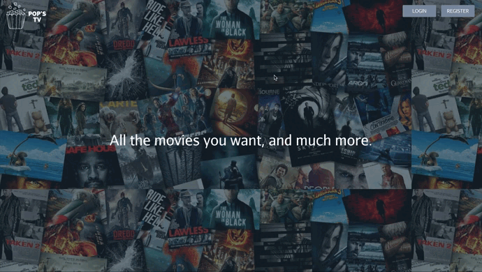
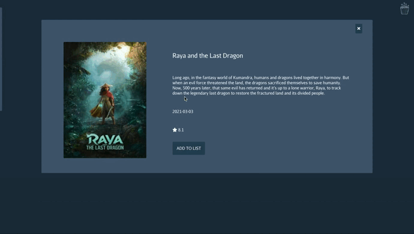
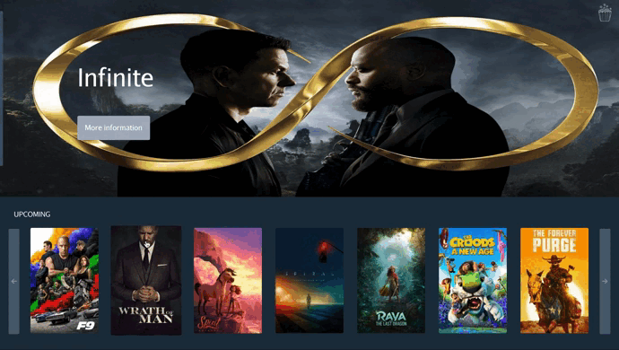

<h1 align="center">
  <!--    POP'S TV -->
  
   
  POP'S TV 
</h1>

---

- [About](#about)   

- [Instructions](#instructions)

- [Screenshots](#images)

- [Tools](#tools)

- [Author](#developers)

---

## About :speech_balloon:

Challenge from the Fullstack Developer Bootcamp at <a href="https://geekshubsacademy.com/">GeeksHubs Academy</a> where we have to create the frontend for a rental movies.

In the following application, you would be able to log in once you have registered. 

Then you could look at top rated, popular or upcoming movies and search films by title or genre.

If you want to watch the movie, you need to add it to your list and immediately after you would be able to see the play button.

Finally you would just need to prepare some popcorn and enjoy the movie! 

 

Starting date: June 21st 2021.  
Due date: July 4th 2021.

Although this project was individual, I used trello to to have a better organization.

 
## Instructions :clipboard: 

The first step is to clone the repository and install the project dependencies.

### `npm i`

Next run the server.

### `npm start`

 

On the other side, you will need to clone the backend from [THIS REPOSITORY](https://github.com/AdrianaFayos/movies_backend) and follow its instructions to run it.

## Screenshots 📸

Login

Home

Add one movie to your list and enjoy it

Search your favorite movie

## Tools 🔧

       

Installed dependencies: Redux, React-redux, Redux-localstorage-simple, Axios, Nodemon, React-Router-Dom, Moment, React-tooltip, Sweetalert, React-player & Fontawesome.

## Author ✍️

[Adriana Fayos](https://github.com/AdrianaFayos)

---

[🔝](#top)
