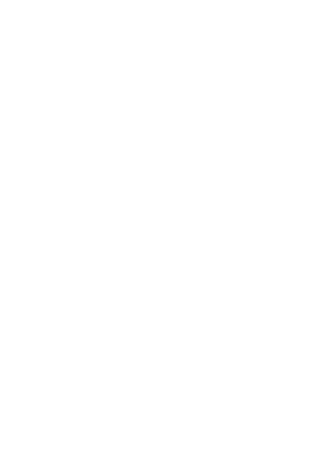

<h1 align="center">
  <!--    POP'S TV -->
    🍿 POP'S TV FRONTEND 🍿
</h1>

---

- [About](#about)   

- [Instructions](#instructions)

- [Screenshots](#images)

- [Tools](#tools)

- [Developers](#developers)

---

## About :speech_balloon:

Challenge from the Fullstack Developer Bootcamp at <a href="https://geekshubsacademy.com/">GeeksHubs Academy</a> where we have to create the frontend for a rental movies.

Starting date: June 21st 2021.  
Due date: July 4th 2021.

 
## Instructions :clipboard: 

The first step is to clone the repository and install the project dependencies.

### `npm i`

Next run the server.

### `npm start`

 

On the other side, you will need to clone the backend from [THIS REPOSITORY](https://github.com/AdrianaFayos/movies_backend) and follow its instructions to run it.

## Screenshots 📸

## Tools 🔧

       

Installed dependencies: Redux, React-redux, Redux-localstorage-simple, Axios, Nodemon, React-Router-Dom, Moment, React-tooltip, Sweetalert, React-player & Fontawesome.

## Developers ✍️

[Adriana Fayos](https://github.com/AdrianaFayos)

---

Thanks to all our classmates for the help and work as a great team.

[🔝](#top)
